# 4×4 WDM Optical Communication System

Design, simulation, and performance analysis of a 4-channel optical link built on **Wavelength Division Multiplexing (WDM)**. Four independent data streams are transmitted over a single 50 km single-mode fiber, then separated and recovered at the receiver. The project was modeled and simulated in **OptiSystem**.

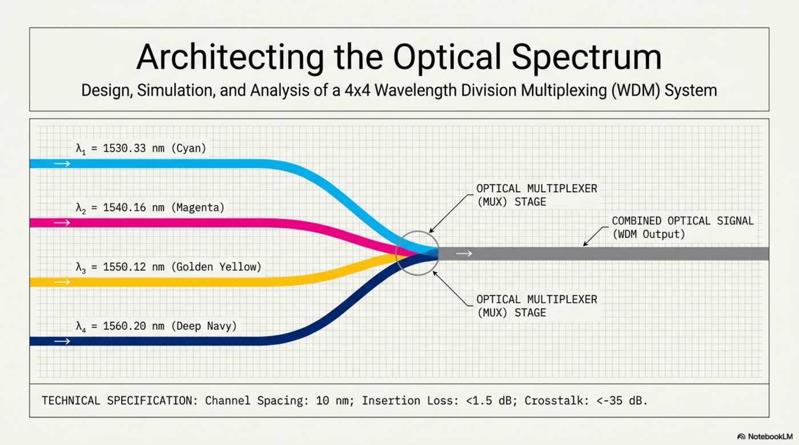

---

## Table of Contents

- [Overview](#overview)
- [System Architecture](#system-architecture)
- [Simulation Parameters](#simulation-parameters)
- [Results](#results)
- [Analysis & Conclusion](#analysis--conclusion)
- [Optimization Strategies](#optimization-strategies)
- [Repository Structure](#repository-structure)
- [Running the Simulation](#running-the-simulation)
- [References](#references)

---

## Overview

Traditional single-wavelength On-Off Keying (OOK) links are capacity-limited. WDM multiplies fiber capacity by carrying multiple independent streams on distinct carrier frequencies inside one physical fiber.

This project implements a 4-channel WDM link in the **C-Band** (≈1550 nm / 193 THz region), with strict **100 GHz (0.1 THz)** channel spacing, and evaluates signal integrity after a **50 km unamplified** span.

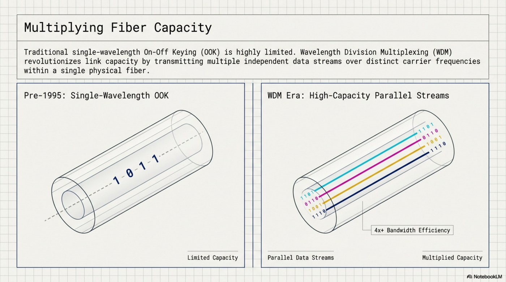

The link operates in the C-Band target zone of the optical spectrum:

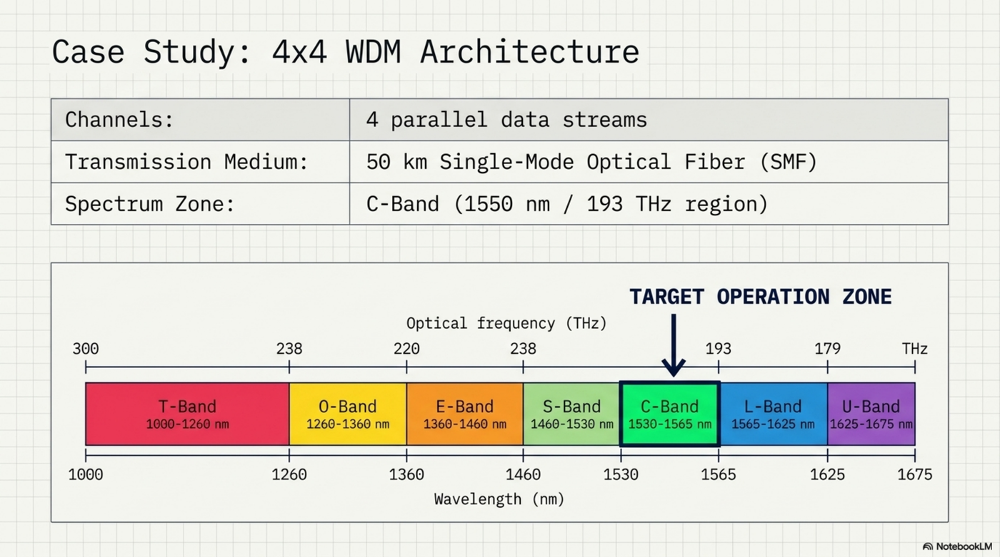

---

## System Architecture

The system is organized into three stages: a transmitter array, the multiplexed fiber link, and a receiver array.

### Stage 1 — Transmitter (Tx) Array

Four parallel channels. Each channel generates a **Pseudo-Random Bit Sequence (PRBS)**, shaped by an **NRZ Pulse Generator**, which drives a **Mach-Zehnder Modulator (MZM)**. Each MZM is fed an optical carrier by a **Continuous-Wave (CW) Laser**.

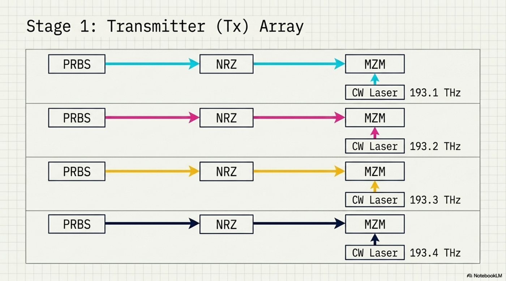

### Stage 2 — Multiplexing & Optical Link

The four modulated signals are combined by a **4×1 WDM Multiplexer** and launched into a **50 km Single-Mode Fiber**. The 100 GHz spacing forms a guard band that prevents inter-channel crosstalk.

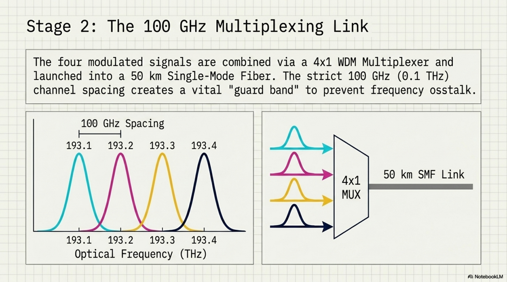

### Stage 3 — Receiver (Rx) Array

A **1×4 WDM Demultiplexer** separates the channels. Each channel passes through a **PIN Photodiode** (optical-to-electrical conversion), a **Low-Pass Bessel Filter**, and a **3R Regenerator & Decision Circuit** to recover the digital sequence.

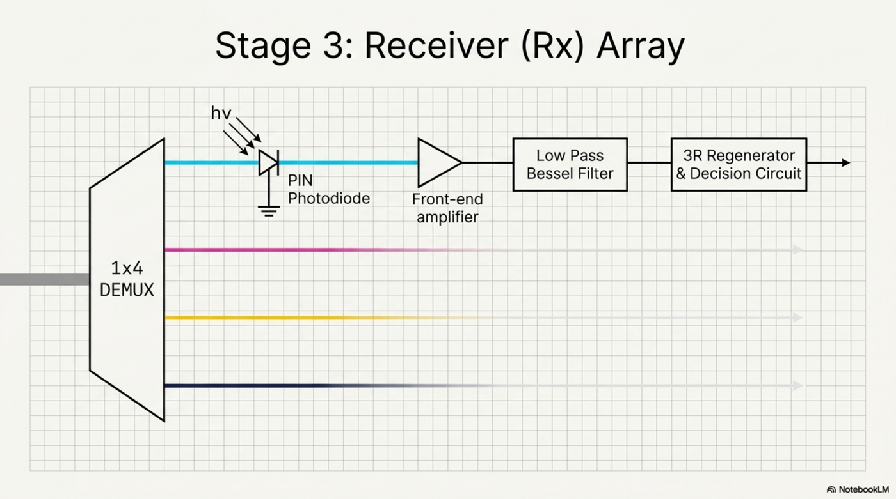

### Component Selection

| Block | Choice | Rationale |
|---|---|---|
| Transmitter source | **CW Laser** | Narrow spectral width, higher coupled power, supports long unamplified reach |
| Photodetector | **PIN Photodiode** | Baseline optical-to-electrical conversion without internal gain |

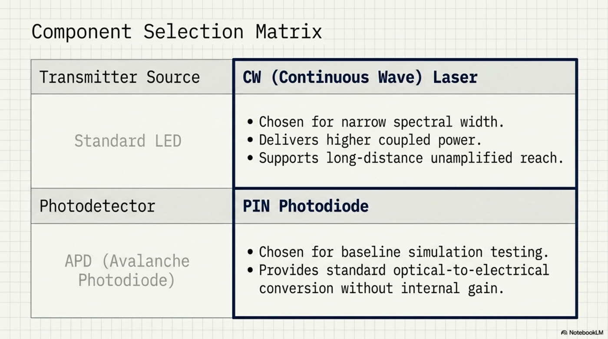

---

## Simulation Parameters

| Parameter | Value |
|---|---|
| Channels | 4 parallel data streams |
| Carrier frequencies | 193.1, 193.2, 193.3, 193.4 THz |
| Channel spacing | 100 GHz (0.1 THz) |
| Transmission medium | Single-mode optical fiber |
| Fiber length | 50 km (unamplified) |
| Spectrum band | C-Band (1530–1565 nm) |
| Modulation | NRZ on-off keying via MZM |

The maximum unamplified reach is governed by the optical power budget:

> **P_T = P_S − P_R = N·l_c + α·L + margin**

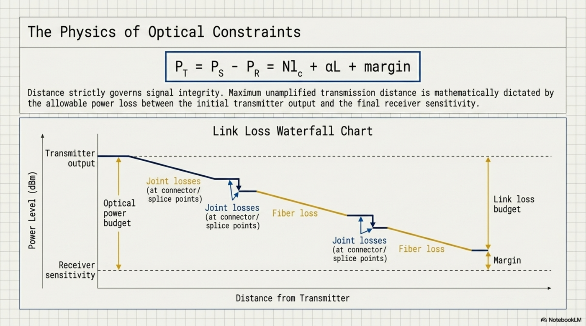

---

## Results

### Result I — Optical Spectrum Analysis (OSA)

The OSA connected after the multiplexer confirms successful aggregation of the four carriers. Four clearly defined peaks appear with no severe overlap, validating the 100 GHz spacing and MUX/DEMUX functionality.

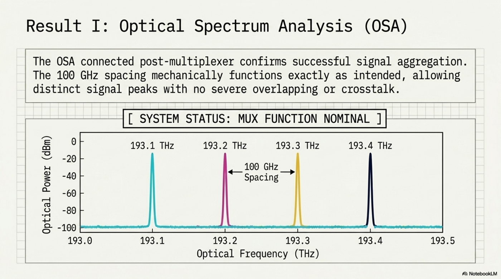

### Result II — Signal Integrity (Channel 1)

Signal integrity was evaluated by overlapping sampled pulse streams into an **eye diagram**. A wide, clear eye indicates a healthy signal; a closing eye indicates noise, dispersion, and inter-symbol interference.

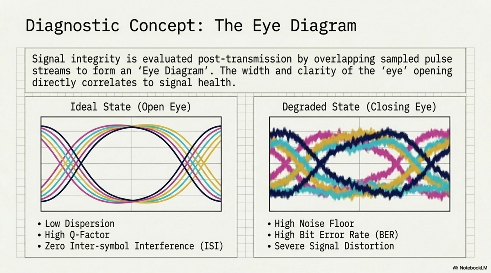

Recovered metrics for Channel 1 after the 50 km span:

| Metric | Value | Industry baseline |
|---|---|---|
| **Maximum Q-Factor** | **3.97034** | Q ≥ 6 |
| **Minimum BER** | **2.86963 × 10⁻⁵** | lower is better |

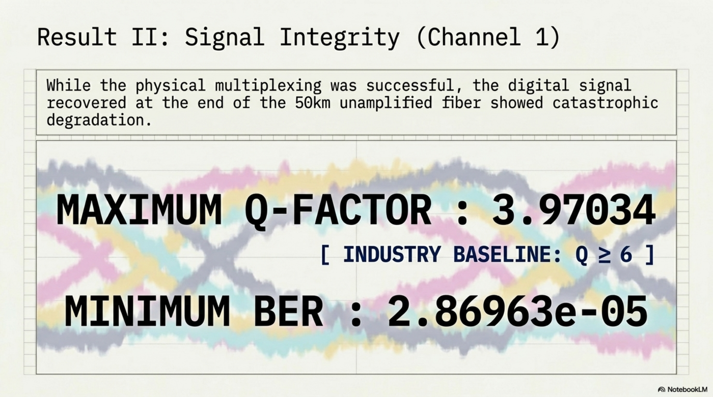

---

## Analysis & Conclusion

The architecture is **functionally sound** — signals are successfully multiplexed, transmitted, and demultiplexed. However, the Channel 1 Q-Factor of ~3.97 falls below the typical Q ≥ 6 baseline, and the BER is higher than ideal.

This is **not a hardware/design failure** — it is an expected power penalty. Pushing a signal through 50 km of single-mode fiber **without amplification** drives the received power perilously close to the photodiode's noise floor, as the link-loss waterfall shows.

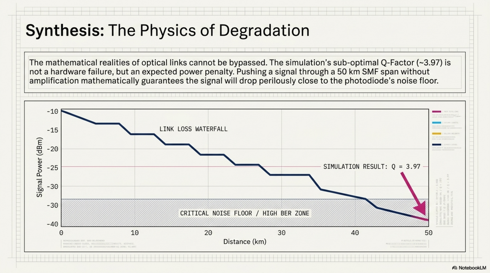

The core takeaway: WDM elegantly solves the **capacity** problem, but the link remains constrained by the **distance** problem. Effective design means actively managing signal decay, not just routing light.

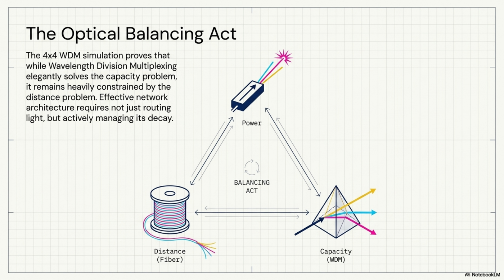

---

## Optimization Strategies

To reach a deployable Q ≥ 6, the signal-to-noise ratio must be improved. Two complementary approaches:

1. **Inline amplification** — Insert an **Erbium-Doped Fiber Amplifier (EDFA)** inline or as a pre-amplifier to periodically restore signal power along the span. (Trade-off: amplifiers add ASE noise that accumulates with each stage.)
2. **Power tuning** — Increase the initial CW laser launch power to shift the entire link-budget waterfall upward, keeping the signal above the noise floor across the full 50 km.

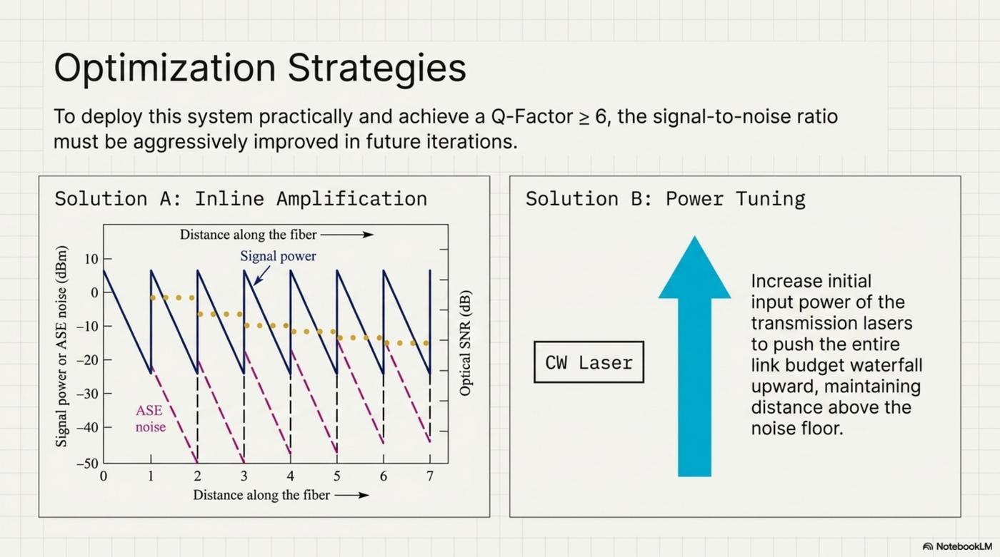

---

## Running the Simulation

This project was built and simulated in **Optiwave OptiSystem**.

1. Install OptiSystem (a valid license is required; Optiwave offers evaluation and academic licenses).
2. Open `Project1.osd` in OptiSystem.
3. Run the simulation and inspect results via the OSA visualizer (post-MUX) and the BER Analyzer / eye diagram (Rx Channel 1).

The exported figures in `docs/` reproduce the key diagrams and results without needing the software open.

---

## References

- Project simulation report: `docs/WDM_System_Simulation_Report.pdf`
- Visual analysis deck: `docs/4x4_WDM_System_Analysis.pdf`
- Optiwave OptiSystem — https://optiwave.com

---

*Generated from the OptiSystem laboratory simulation of a 4×4 WDM optical communication system.*
